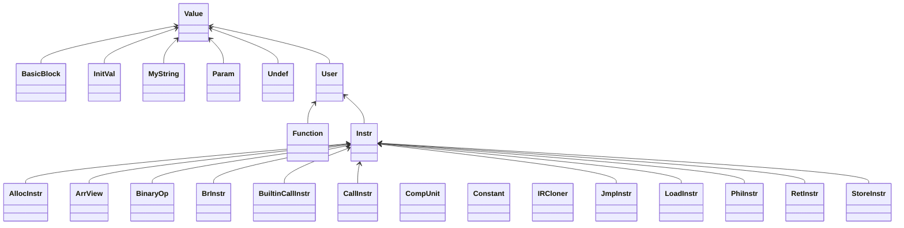

# 编译器文档

## 参考编译器介绍

编译器总体结构设计参考了[GitHub - No-SF-Work/ayame: A compiler that translates SysY (a subset of C language) into ARMv7a, implemented in Java15.](https://github.com/No-SF-Work/ayame)（2021年北航参加编译比赛的一等奖作品），以及参考上述编译器设计的2022年我参加编译竞赛合作完成的编译器。同时参考了[《crafting interpreter》](http://www.craftinginterpreters.com/)的词法分析器实现，总结了自己之前实现过的词法分析器的实现，[sloth-lang: 出于学习目的编写的基于字节码的解释器。](https://gitee.com/aaicy64/sloth-lang)

以Ayame为例（2021年北航参加编译比赛的一等奖作品），分析其结构与组织

### UML


### 文件结构


可以看到主要分为前端（frontend），中端（ir），后端（backend），前端使用ANTLR自动生成，中端采用了类似LLVM IR的SSA形式中间代码，优化被组织为Pass（遍），可以方便调度优化的顺序和开关优化。

IR在内存中的表示为User，Value互相引用的结构（参考LLVM IR），我在课设中也采用了这种设计，将在之后详细说明。

Pass和User，Value的设计是参考的重点。

### 前端参考

因为比赛不要求错误处理，且词法分析和语法分析部分可以用ANTLR等生成器生成，所以前端无法参考Ayame。于是参考了一本较好的编译器设计书籍[《crafting interpreter》](http://www.craftinginterpreters.com/)。它实现了一种类Lua的解释型语言，前端使用手写的自顶向下分析器，并使用了算符优先分析解析表达式（和一些适当的错误处理），后端实现了栈式虚拟机（pcode可参考），并且实现了词法闭包，标记-清理垃圾回收和面向对象等高级功能。

## 编译器总体设计介绍

### 语言选择

选择Java，虽然Java8缺少很多特性，有些代码显得比较冗长，相对而言C++11更加现代，性能也更好，但是之后代码生成和优化部分可能需要维护比较复杂的数据结构（图），Java自动内存管理可以降低编码难度。

### UML图


IR设计最终参考的是LLVM IR的`Value`，`User`的继承层次结构。（见上图Value为根的继承树）这实际上是一种`def-use`网络的形式，这种形式可以很好地支持优化。

后端中间代码采用一种很接近MIPS汇编的形式，除了使用虚拟寄存器和扩展了Phi指令和并行复制指令（用于支持SSA）外，其他和MIPS完全相同。（见上图MCInstr为根的继承树）

Pass为编译器运行的“遍”，用于计算信息（支配，活跃等）和优化（GVNGCM，死代码删除等）。相应的MCPass也是“遍”，区别于Pass只是运行在后端中间代码上，而不是中端中间代码上。遍可能只运行一次，也可能多次，因为相同的优化在其他优化后可能找到更多优化机会，多次运行可能获得更好的效果。

Ty为类型，相对于LLVM IR复杂的类型系统，由于我们只支持整型和整形数组，做了相应的简化。

Reg为寄存器，PReg为物理寄存器，VReg为虚拟寄存器，ValueReg只是在后端代码生成过程中用于保存变量映射关系的中间数据结构。它们构成了如图的继承关系。

还有其他负责词法，语法分析，错误处理等功能的类。

中端代码的设计和Pass的组织参考了Ayame，前端为自己设计的适应课设迭代开发要求的组织结构，后端也在参考Ayame的ARM后端的基础上自行实现。


## 词法分析

主要参考了[《crafting interpreter》](http://www.craftinginterpreters.com/)的词法分析器实现，总结了自己之前实现过的词法分析器的实现，[sloth-lang: 出于学习目的编写的基于字节码的解释器。](https://gitee.com/aaicy64/sloth-lang)

### 完成后

整个词法分析器是一个while{switch{...}}结构，对于关键字和标识符，采用直接识别而不是真的构建DFA，这样比较便于维护，对于不可能冲突的单字符，如+，-，直接识别，对于可能冲突的单双字符进行特判，如/，/*，//。此外需要处理数字串、注释和格式字符串等。

对格式字符串的部分错误字符识别放在此处。

## 语法分析

递归下降法配合适当的Look forward以及回溯（用于区分表达式和赋值，因为左值可能比较复杂，所以需要先运行一部分找到有没有表示赋值的`=`，回溯只在这里进行，所以性能尚可接受），因为输出语法树形式要求的限定，没有使用可以简化表达式识别的Pratt Parser（自顶向下算符优先级，其实就是OPG，这大概会把表达式树展平，不太好处理）。

### 完成后

最终的设计中，对赋值语句采用了回溯的方式（和表达式语句冲突），对表达式采用了改写文法（EBNF）然后对语法树进行变形的方式。

## 错误处理相关

使用一个单例类管理错误的产生和输出。

### 完成后

对于可能（因为错误）不存在的Token，如`)`，`]`，`;`，不能作为判断语法成分的条件（要求FIRST集，而不能通过这些符号作为判断的依据，比如对于函数调用，识别是否是空参不能判断在`(`后读到`)`，因为可能因为错误右括号不存在，而应该识别下一个符号如果是在`First(Exp)`中，则表示有参数）。因为错误处理需要建立符号表，所以是和中间代码生成一起写的（词法分析和语法分析也处理一些错误）。

为了支持在后续的分析过程中（语法、语义）产生的错误能输出行号，需要在词法分析的元素（`Token`），和语法分析的语法树中携带和传递行号信息。

关于错误识别的组织：尽量采用有意义的变量名，而不是要求的单个字母。如：

```java
public static RequiredErr buildIllegalFormatString(int line) {
    return new RequiredErr('a',line);
}
public static RequiredErr buildRedefinedName(int line) {
    return new RequiredErr('b', line);
}
public static RequiredErr buildUndefinedName(int line) {
    return new RequiredErr('c', line);
}
...
```


## 中间代码生成

采用简化的LLVM IR，先生成load，store形式，再通过mem2reg化为SSA形式（Mem2Reg作为一个Pass）。

### 完成后

对于初步的`Load,Store`形式代码生成，行为类似于栈式虚拟机，计算结果要`store`，获取变量先`load`。然后通过`Mem2Reg`算法转化到SSA（静态单赋值）形式。算法见《the SSA book》和软院的教程，基本思想是在支配边界插入`phi`函数，然后沿着支配树传播定义（可能说法不太严谨）。

主要的难点在对高级语言控制结构（循环，分支）的转换，中间代码在生成时就构建了基本块，以循环为例，在生成时先生成空的出口块和循环体块（或者叫循环体的入口块），然后跳转到生成条件表达式的子程序：

```java
BasicBlock bb = genLor((NonTerminator) cond.getChild(0), stmt1BB, exitBB);
```

它接受两个块作为参数，分别是判断为真的跳转目标和为假的跳转目标。

然后生成循环体（跳转到生成`stmt`的子程序），之后生成跳转语句将这些块连起来生成循环结构。这个过程是递归的，注意对循环里嵌套循环的处理，一些数据可能需要维护一个栈（也可能是隐式地使用Java或者C++的调用栈，如果把数据放在参数里的话）。

短路求值可以用跳转模拟，如

```
if (a || b) {
	stmt();
}
对应
if a goto l2 else goto l1;
l1:
if b goto l2 else goto l3;
l2:
stmt();
l3:
```

`&&`类似（无副作用的短路求值可能有优化机会，位运算，不过MARS是单周期模拟器，可能没有效果）。

在中端代码生成部分可能也需要维护一些信息，如循环嵌套深度等，供优化和寄存器分配的启发式算法使用。


## 后端代码生成

φ函数的解构使用Brigg的算法（基于φ等价类的需要构建冲突图，且不好理解，标准方式会划分关键边，产生很多跳转）。
实际完成后补充：还是采用了拆关键边的算法，因为不确定φ的liveIn，liveOut语义，论文使用了liveOut
但是没有明确φ的活跃计算的方式，稳妥起见还是不用了。

寄存器分配采用图染色法。在第一次代码生成还没有实现，暂时没有分配寄存器，临时变量全部放在栈上。

尽量使用伪指令，要不白白浪费一个寄存器（$at）。

### 完成后

使用伪指令可能带来性能损失，特别是一些汇编成3条指令的指令，比如`add`用于立即数。

对于图着色寄存器分配，如果采用《现代编译原理》提供的算法，那么一定要针对自己选择的语言进行优化，否则很容易超时。

比如上述算法中有很多集合操作，那么对于遍历多的集合，可能用`ArrayList`比较好，对于使用`contain`操作比较多的集合，可能用`HashSet`比较好。同时需要注意对集合交并等运算的高效实现。

## 代码优化

此部分将作为独立的优化文章，这里只做简要介绍。

优化由于作为可以开关和调整顺序的Pass，完成前就设计好的结构，只需要分别实现各个Pass即可。整个过程中架构没有发生修改。

### IR实现

模仿LLVM IR实现的Value和User的继承结构是IR实现的核心，是各种优化的基础。



User顾名思义就是会使用其他值的值（它也继承值，User也可能被使用）。

例如，Instruction是User，对于一个二元运算指令BinaryOp，它use它的两个操作数，并被使用它的结果的指令使用，IR需要维护一个值的使用者和使用信息，比如

```
%1 = add 1, 1
%2 = add 2, 2
%3 = add %1, %2
%4 = add %3, %2
```

对于`%3 = add %1, %2` 它维护了对第一行和第二行的指令的引用，并且因为它被第四行代码使用，它也维护了对第四行指令的引用，即

```
Object %3{
	uses: [%1, %2]
	users: [%4]
}
```

这种形式可以方便优化，这里还有几个在Value和User上的方法：

```
void replaceUseWith(Value old, Value nnew)
void removeMeFromAllMyUses() 
void replaceAllUsesOfMeWith(Value other)
```

分别为：1.将对旧值的使用替换为新值，2.从使用的值的users列表中移出自己，通常用于这个值被删除了（比如死代码）3.将对自己的使用替换为对另一个值的使用，通常用于值标号合并公共子表达式，比如另一个值（指令）也算出来一样的值，我们就替换过来然后删掉这条冗余指令。

通过维护上述uses，user关系，上述操作（也维护了这些关系）能够以较高的效率实现。

### 实现的优化

中端：

- 指令简化，简化如phi，算术，连续加法等指令
- 控制流图优化，删除空块，不可达块，唯一前驱后继块合并等
- 函数内联
- 全局常量识别，识别没被标为`const`但实际上是常量的变量
- 简单死代码删除
- 简单常量传播
- GVNGCM（全局值标号和全局代码移动）
- Mem2Reg，生成SSA形式

后端：

- 跳转优化，优化连续跳转和跳转到后继紧邻块
- 窥孔优化
- 除法优化，用低代价运算替代高代价的除法和模运算
- 图着色寄存器分配
