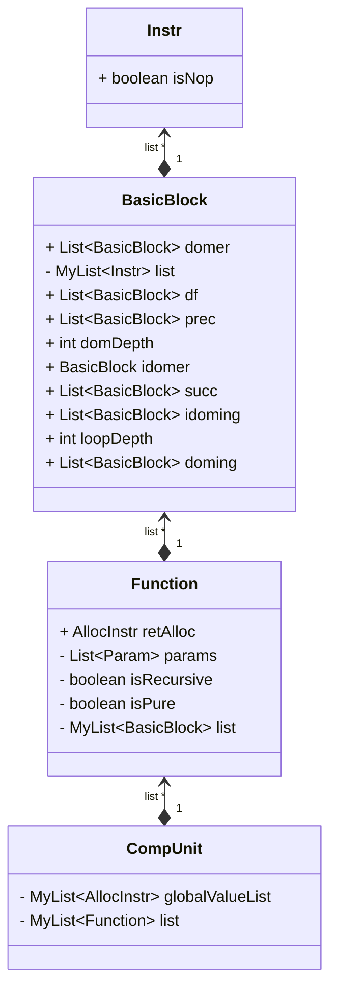
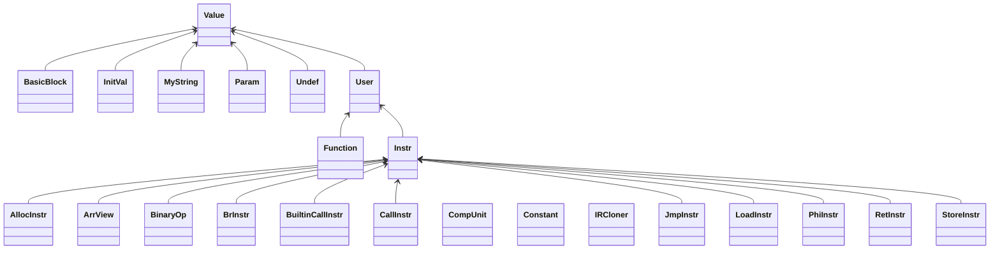

# 优化文档

## 优化目标

优化目标是MARS，所以优化应该针对其单周期的特点以及计分标准（加权指令计数），所以指令调度类优化没有效果，不执行的代码不删除也不会有影响。优化任务时间有限，一些优化虽然对于产品级编译器是必要的，但是课设可以不做。

## IR设计

IR的设计对于优化的实现有重要的作用，这里我使用了模仿LLVM IR的一种更为简化的SSA（静态单赋值）形式的IR。形式上如下：

```
%long_array(%0:int,):int{
%1:
	%2 = alloc Stack int[10000]
	jmp %10
%4:
	%5 = mul %11,%11
	%6 = mod %5,10
	store %6,%2[%11]
	%8 = add %11,1
	jmp %10
%10:
	%11 = phi [0,%1][%8,%4]
	%12 = slt %11,10000
	br %12,%4,%14
%14:
	%15 = alloc Stack int[10000]
	jmp %24
%17:
	%18= load %2[%25]
	%19 = mul %18,%18
	%20 = mod %19,10
	store %20,%15[%25]
	%22 = add %25,1
	jmp %24
	...
```

IR特点：

- 保留了函数的结构
- 包含基本块
- 指令形式上是四元式

IR主要数据结构：



形成指令-基本块-函数-编译单元的层次。

### Value，User与Def-Use链（网？）

模仿LLVM IR实现的Value和User的继承结构是IR实现的核心，是各种优化的基础。



User顾名思义就是会使用其他值的值（它也继承值，User也可能被使用）。

例如，Instruction是User，对于一个二元运算指令BinaryOp，它use它的两个操作数，并被使用它的结果的指令使用，IR需要维护一个值的使用者和使用信息，比如

```
%1 = add 1, 1
%2 = add 2, 2
%3 = add %1, %2
%4 = add %3, %2
```

对于`%3 = add %1, %2` 它维护了对第一行和第二行的指令的引用，并且因为它被第四行代码使用，它也维护了对第四行指令的引用，即

```
Object %3{
	uses: [%1, %2]
	users: [%4]
}
```

这种形式可以方便优化，这里还有几个在Value和User上的方法：

```
void replaceUseWith(Value old, Value nnew)
void removeMeFromAllMyUses() 
void replaceAllUsesOfMeWith(Value other)
```

分别为：1.将对旧值的使用替换为新值，2.从使用的值的users列表中移出自己，通常用于这个值被删除了（比如死代码）3.将对自己的使用替换为对另一个值的使用，通常用于值标号合并公共子表达式，比如另一个值（指令）也算出来一样的值，我们就替换过来然后删掉这条冗余指令。

通过维护上述uses，user关系，上述操作（也维护了这些关系）能够以较高的效率实现。

## 中端优化

中端优化是在上述IR上进行的。

### 指令简化

对于所以分支值都一样的phi指令（phi指令：SSA特有，例如`%5 = phi [%1, %2] [%3, %4]`，则phi指令值取%1如果从%2基本块跳转来，取%3如果从基本块%4跳转来，用于保证SSA性质），可以合并。

对于形如`a+1+2`， `a-1-2`这样的式子可以合并常数，一般的常量传播由于产生的表达式树形状可能比较容易合并`1+2+a`这样的式子，上述形式需要单独处理。树大概会长这样：

```
(+ (+ a 1) 2)
```

如果只考虑一个表达式子树（如（+ a 1）），则难以化简。除了上面的加减法，可能也有其他更复杂的算术指令简化方式，比如乘除，甚至可能可以运用分配律。

连续的加同一个常数如果超过乘法的代价，可以简化成乘法。

### 控制流图简化

在代码生成过程中，可能生成一些空块，或者在优化过程中产生一些无法到达的块，或者是唯一前驱后继的两块等一些冗余的块或跳转，可以删除或者合并。

### 函数内联

可以将短函数内联（长函数也可以其实，但是可能由于冲突过多影响图着色，甚至递归都可以考虑内联几层），函数内联的意义不仅在于减少调用开销，还可以暴露更多优化机会，比如把一些运算通过函数内联放在了一起，可以暴露更多运算优化。函数内联的实现包括两部分：复制IR函数结构（如果需要维护复杂的IR数据结构可能不是很简单）和内联函数到调用点。

### 全局常量识别

有一些从未被写过的全局变量并没有被标成`const`，但是可以在中端识别（User中只有load，没有store），和函数内联一样，也可以暴露更多优化。

### 简单死代码删除

一个没有使用者的指令是无用的，可以删除，这个过程是迭代的，删除一条指令也会将它使用的值加入工作表，看它使用的值是不是也可以被删除，直到工作表为空。

算法来自《现代编译原理》SSA主题。

### 简单常数传播

如果一个算数指令可以在编译期求值，则对这条指令的使用可以替换为对它的计算结果的使用，同时它的使用者需要被加入工作表，例如

 ```
 %3 = add 1,2
 %4 = add %3,4
 ```

%3被优化为3，而它的使用者%4也变得可以优化。

算法来自《现代编译原理》SSA主题，上述两个算法在书中都提供了伪代码。

也可以做条件常量传播和激进的死代码删除，在书中也有介绍，但是由于时间原因没有实现。

### GVNGCM（全局值标号和全局代码移动）

理论课讲了消除局部公共子表达式，而要消除全局公共子表达式，需要保持支配关系，这通过全局代码移动可以实现，GCM同时也负责将循环不变量提出循环。

例如：

```
br %1,label1,label2
label1:
	%2 = 2 % %0
label2:
	%3 = 2 % %0
```

我们可能通过值标号把代码优化为如下形式：

```
br %1,label1,label2
label1:
	%2 = 2 % %0
label2:
	%3 = %2
```

（仅示意，实际上是将对%3的使用替换为对%2的使用）

但这是不正确的，因为进入`label2`分支时，`2 % %0`并没有被计算，也就是不能保证支配关系。

GCM将指令移动到支配它的使用并被它使用的值支配的，循环嵌套层数最小的位置。如上述例子：

```
%2' = 2 % %0
br %1,label1,label2
label1:
	%2 = %2'
label2:
	%3 = %2'
```

(例子中可能优化没有效果，但是运算可能被提出循环)

对于全局值标号，对CFG进行一次逆后序遍历（多次可能有效，但一次足够），可以用HashMap存储标号，发现算过就替换使用，标号思路和局部公共子表达式删除相似。

详见Cliff Click的论文。

### Mem2Reg

这其实不算优化，算是SSA的构建过程，需要计算支配信息（支配，直接支配，支配边界等），详见软件学院的教程。[buaa-se-compiling.github.io](https://buaa-se-compiling.github.io/miniSysY-tutorial/challenge/mem2reg/help.html)

## 后端优化

### 后端IR

后端IR是使用虚拟寄存器的MIPS指令加上Phi和并行复制指令（用于消phi），进入后端就需要消解SSA形式了，具体可以参考《the SSA book》的标准解构算法，或者基于phi网（？）的拆解算法（不太好理解）。需要注意复制丢失问题和交换问题。

### 跳转优化

跳转到紧跟着的基本块的跳转可以被删除，对于这种形式：

```
j L1
...
L1:
j L2
...
L2:
j L3
...
L3:

```

可以优化为一步跳转，并在保证正确的情况下删除中间的空块。

### 窥孔优化

一种非常局部的优化，例如

```assembly
move $8, $8

move $8, $9
move $9, $8
```

或者

```assembly
sle $7,$8,$0
bnez $7, label
优化为
blez $8, label
```

相当于一个小窗口在代码上移动，看到可以优化的序列则优化。

（可能可以加上数据流分析，在确定一条指令的结果寄存器在之后都不活跃再放心删除，因为做了GVNGCM不知道一条指令的结果可能被几条指令共用）

### 除法优化

详见论文《Division by Invariant Integers using Multiplication》，翻译它给出的伪代码（其实看得不是很懂，但是可以逐句翻译）。

### 图着色寄存器分配

可以参考《现代编译原理》给出的伪代码（非常详细），注意优化，否则很容易超时，比如其中有很多集合操作，那么对于遍历多的集合，可能用`ArrayList`比较好，对于使用`contain`操作比较多的集合，可能用`HashSet`比较好。同时需要注意对集合交并等运算的高效实现。也可以考虑先简化CFG。图着色启发式溢出可能需要循环嵌套深度信息，需要在前端或者中端维护。

如果采用SSA形式，则一定要完成move合并，因为SSA产生了很多短活跃区间变量。

图着色可能花费很多时间，可以先写一个变量全分配在栈上的简单分配器完成阶段性作业。
